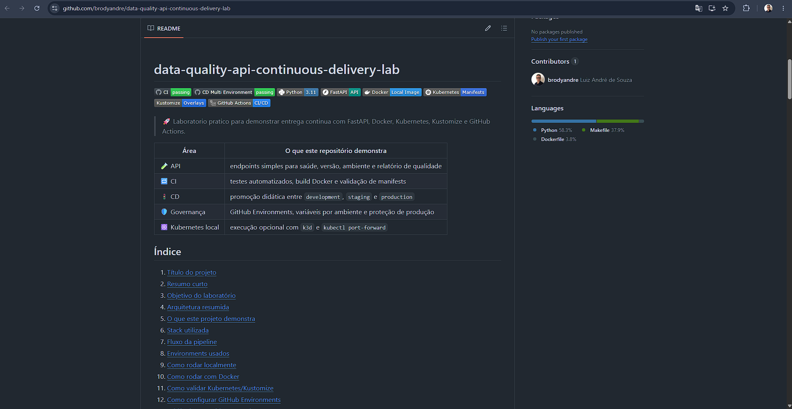
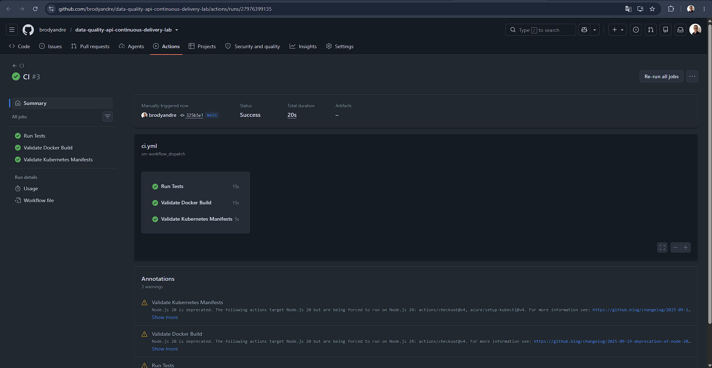
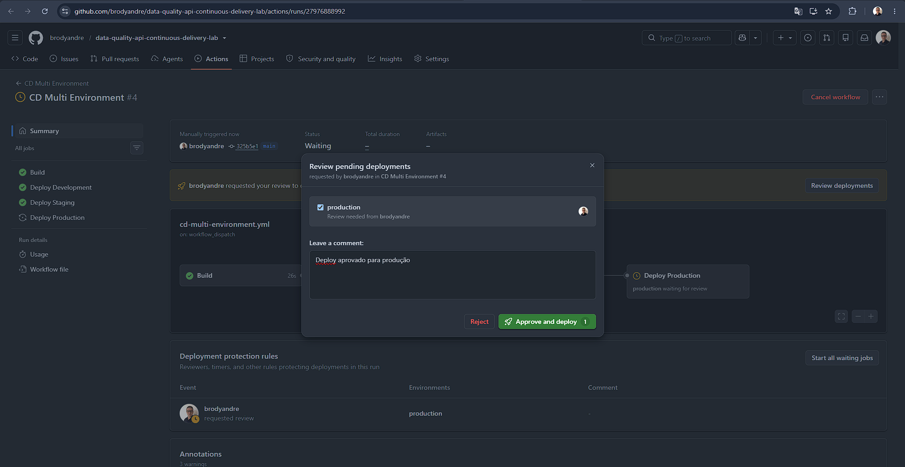
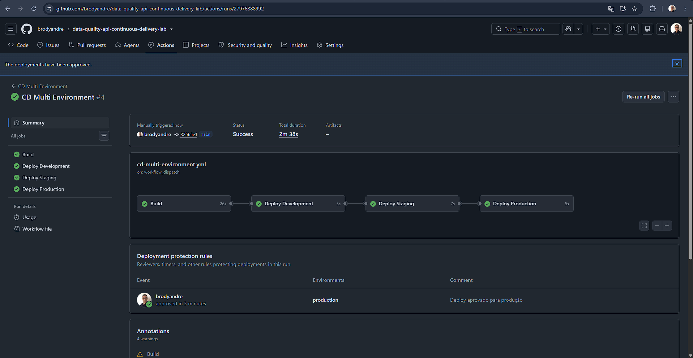
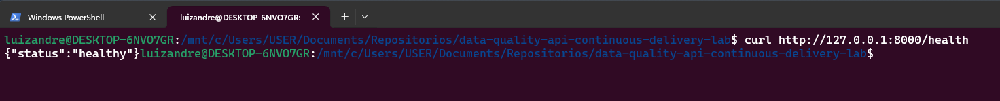
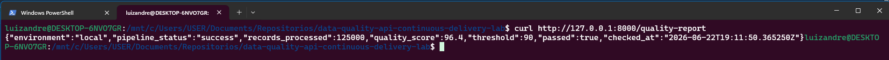
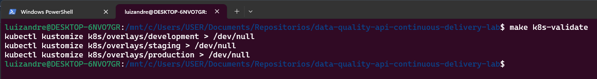
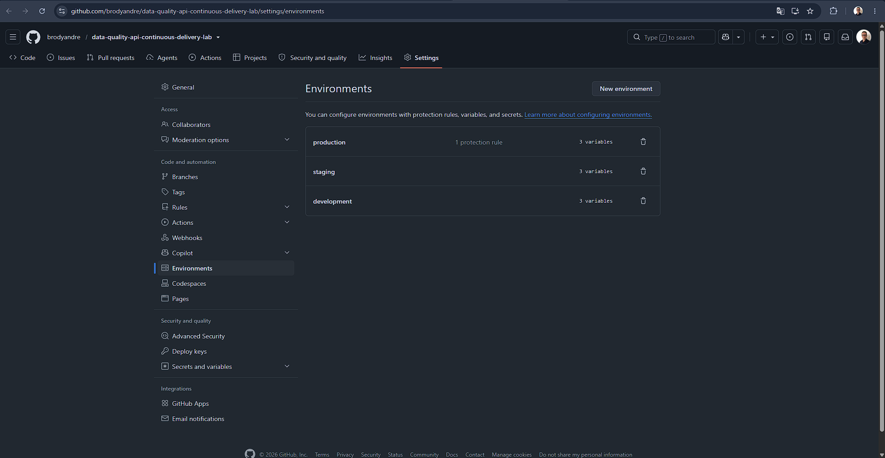
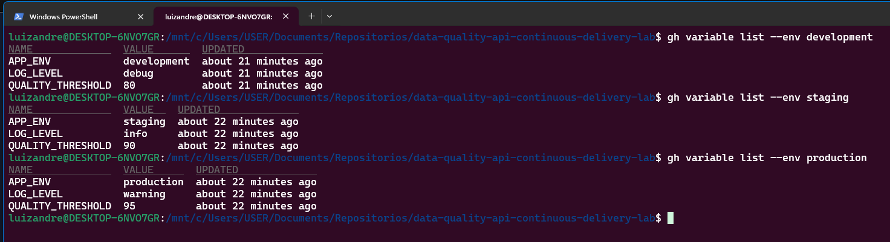
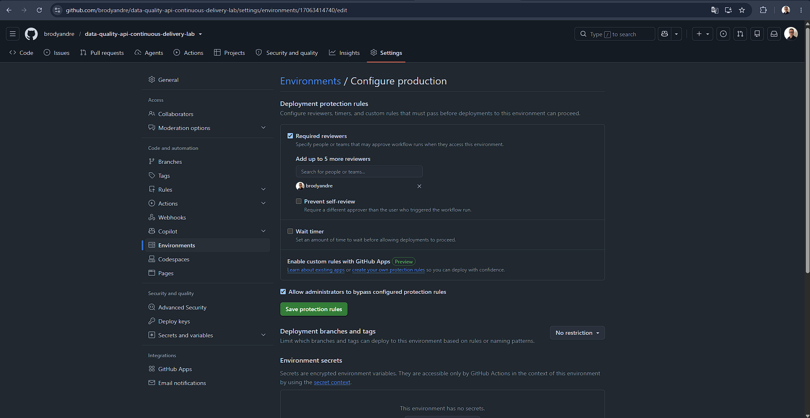

<a id="indice"></a>

# data-quality-api-continuous-delivery-lab


> 🚀 Laboratorio pratico para demonstrar entrega continua com FastAPI, Docker, Kubernetes, Kustomize e GitHub Actions.

| Área | O que este repositório demonstra |
| --- | --- |
| 🧪 API | endpoints simples para saúde, versão, ambiente e relatório de qualidade |
| 🔁 CI | testes automatizados, build Docker e validação de manifests |
| 🚦 CD | promoção didática entre `development`, `staging` e `production` |
| 🛡️ Governança | GitHub Environments, variáveis por ambiente e proteção de produção |
| ☸️ Kubernetes local | execução opcional com `k3d` e `kubectl port-forward` |

## Índice

1. [Título do projeto](#titulo-do-projeto)
2. [Resumo curto](#resumo-curto)
3. [Objetivo do laboratório](#objetivo-do-laboratorio)
4. [Arquitetura resumida](#arquitetura-resumida)
5. [O que este projeto demonstra](#o-que-este-projeto-demonstra)
6. [Stack utilizada](#stack-utilizada)
7. [Fluxo da pipeline](#fluxo-da-pipeline)
8. [Environments usados](#environments-usados)
9. [Como rodar localmente](#como-rodar-localmente)
10. [Como rodar com Docker](#como-rodar-com-docker)
11. [Como validar Kubernetes/Kustomize](#como-validar-kuberneteskustomize)
12. [Como configurar GitHub Environments](#como-configurar-github-environments)
13. [Evidências sugeridas com prints](#evidencias-sugeridas-com-prints)
14. [Próximos passos](#proximos-passos)

<a id="titulo-do-projeto"></a>

## 1. 🚀 Título do projeto

`data-quality-api-continuous-delivery-lab`

Laboratório voltado para estudo e demonstração de CI/CD com foco em GitHub Actions, GitHub Environments, proteção de produção e entrega contínua entre múltiplos ambientes.



[Voltar ao índice](#indice)

<a id="resumo-curto"></a>

## 2. 🧭 Resumo curto

Este projeto simula o ciclo de validação e promoção de uma API pequena entre `development`, `staging` e `production`. O foco não é cloud nem deploy real em produção, e sim a organização do fluxo, a separação entre ambientes e a demonstração de boas práticas de pipeline.

[Voltar ao índice](#indice)

<a id="objetivo-do-laboratorio"></a>

## 3. 🎯 Objetivo do laboratório

Demonstrar como estruturar um repositório pequeno, claro e profissional para estudar:

- validação automatizada em `pull requests` e `pushes`
- build local de imagem Docker
- organização de manifests com `Kustomize`
- promoção didática entre ambientes
- uso de GitHub Environments com gates de aprovação
- proteção de produção como parte do fluxo de entrega contínua

O deploy deste laboratório é simulado para fins didáticos. Nesta versão, não há deploy real em cloud e não há publicação de imagem em registry.

[Voltar ao índice](#indice)

<a id="arquitetura-resumida"></a>

## 4. 🏗️ Arquitetura resumida

- `app/`: aplicação FastAPI
- `tests/`: testes automatizados com `pytest`
- `Dockerfile`: empacotamento da API para execução local
- `k8s/base/`: `Deployment` e `Service` compartilhados
- `k8s/overlays/`: variações por ambiente com `Kustomize`
- `.github/workflows/ci.yml`: pipeline de validação
- `.github/workflows/cd-multi-environment.yml`: pipeline didática de entrega contínua
- `docs/`: material de apoio sobre ambientes, pipeline e execução local

Documentos complementares:

- [docs/pipeline-flow.md](docs/pipeline-flow.md)
- [docs/environments.md](docs/environments.md)
- [docs/protection-rules.md](docs/protection-rules.md)
- [docs/local-kubernetes.md](docs/local-kubernetes.md)
- [docs/evidence/README.md](docs/evidence/README.md)

[Voltar ao índice](#indice)

<a id="o-que-este-projeto-demonstra"></a>

## 5. ✅ O que este projeto demonstra

- pipeline de CI para `main`
- testes automatizados com `pytest`
- validação de build Docker sem publicação
- validação de manifests Kubernetes com `kubectl kustomize`
- separação clara entre `development`, `staging` e `production`
- uso de variáveis por ambiente com fallback em workflow
- promoção sequencial entre ambientes
- demonstração opcional de deploy local real com `k3d`

[Voltar ao índice](#indice)

<a id="stack-utilizada"></a>

## 6. 🧰 Stack utilizada

| Tecnologia | Papel no laboratório |
| --- | --- |
| 🐍 Python | base da aplicação e dos scripts de execução |
| ⚡ FastAPI | construção da API HTTP |
| 🧪 Pytest | testes automatizados |
| 🐳 Docker | empacotamento local da aplicação |
| ☸️ Kubernetes | estrutura de deploy local |
| 🧩 Kustomize | customização por ambiente |
| 🚢 k3d | cluster Kubernetes local opcional |
| 🔄 GitHub Actions | CI/CD e promoção entre ambientes |

[Voltar ao índice](#indice)

<a id="fluxo-da-pipeline"></a>

## 7. 🔁 Fluxo da pipeline

### CI

O workflow `ci.yml` valida o projeto em `pull_request` para `main`, `push` para `main` e `workflow_dispatch`.

Etapas principais:

1. checkout do código
2. setup do Python
3. instalação de dependências
4. execução dos testes com `pytest`
5. validação do build Docker
6. validação dos overlays com `kubectl kustomize`



### CD

O workflow `cd-multi-environment.yml` demonstra uma entrega contínua em múltiplos ambientes.

Sequência:

1. `build`
2. `deploy-development`
3. `deploy-staging`
4. `deploy-production`

Cada job de deploy usa um GitHub Environment e simula a entrega renderizando o overlay correspondente. O objetivo é destacar governança, promoção e proteção de produção, não executar deploy real em cloud.

### CD aguardando aprovação em `production`



### CD concluído com sucesso



[Voltar ao índice](#indice)

<a id="environments-usados"></a>

## 8. 🌍 Environments usados

| Environment | Uso no laboratório | QUALITY_THRESHOLD | LOG_LEVEL | Replicas |
| --- | --- | --- | --- | --- |
| `development` | validação inicial e feedback rápido | `80` | `debug` | `1` |
| `staging` | promoção intermediária antes de produção | `90` | `info` | `1` |
| `production` | etapa final protegida do fluxo | `95` | `warning` | `2` |

Os manifests usam a mesma base e mudam apenas o necessário por ambiente.

[Voltar ao índice](#indice)

<a id="como-rodar-localmente"></a>

## 9. 💻 Como rodar localmente

```bash
python3 -m venv .venv
source .venv/bin/activate
pip install -r requirements.txt -r requirements-dev.txt
make test
make run
```

Depois disso, a API fica disponível em `http://127.0.0.1:8000`.

Exemplos de teste:

```bash
curl http://127.0.0.1:8000/health
curl http://127.0.0.1:8000/version
curl http://127.0.0.1:8000/environment
curl http://127.0.0.1:8000/quality-report
```

### Endpoint `/health`



### Endpoint `/quality-report`



[Voltar ao índice](#indice)

<a id="como-rodar-com-docker"></a>

## 10. 🐳 Como rodar com Docker

```bash
make docker-build
docker run --rm -p 8000:8000 \
  -e APP_ENV=local \
  -e APP_VERSION=0.1.0 \
  -e QUALITY_THRESHOLD=90 \
  -e LOG_LEVEL=info \
  data-quality-api:local
```

Com o container em execução:

```bash
curl http://127.0.0.1:8000/health
curl http://127.0.0.1:8000/version
curl http://127.0.0.1:8000/environment
curl http://127.0.0.1:8000/quality-report
```

[Voltar ao índice](#indice)

<a id="como-validar-kuberneteskustomize"></a>

## 11. ☸️ Como validar Kubernetes/Kustomize

Sem cluster:

```bash
make k8s-validate
make render-development
make render-staging
make render-production
```

Execução local opcional com `k3d`:

```bash
make cluster-create
make docker-build
make cluster-import-image
make k8s-deploy-dev
make k8s-status K8S_ENV=development
make k8s-port-forward
```

Guia detalhado: [docs/local-kubernetes.md](docs/local-kubernetes.md)



[Voltar ao índice](#indice)

<a id="como-configurar-github-environments"></a>

## 12. 🛡️ Como configurar GitHub Environments

Crie três GitHub Environments:

- `development`
- `staging`
- `production`

Configure, quando desejar, estas variáveis:

- `APP_ENV`
- `QUALITY_THRESHOLD`
- `LOG_LEVEL`

Sugestão inicial:

- `development`: `APP_ENV=development`, `QUALITY_THRESHOLD=80`, `LOG_LEVEL=debug`
- `staging`: `APP_ENV=staging`, `QUALITY_THRESHOLD=90`, `LOG_LEVEL=info`
- `production`: `APP_ENV=production`, `QUALITY_THRESHOLD=95`, `LOG_LEVEL=warning`

Sugestão de governança:

- `development` sem aprovação manual
- `staging` como etapa intermediária
- `production` com reviewers obrigatórios

Mesmo sem essas variáveis configuradas, os workflows usam fallback para continuar funcionais.

### GitHub Environments



### Variables por environment



### Protection rule de `production`



[Voltar ao índice](#indice)

<a id="evidencias-sugeridas-com-prints"></a>

## 13. 📸 Evidências sugeridas com prints

Para apresentar este laboratório a recrutadores técnicos, vale registrar:

- execução bem-sucedida do workflow `CI`
- execução do workflow `CD Multi Environment`
- tela dos GitHub Environments configurados
- aprovação manual ou regra de proteção de `production`
- logs de renderização por ambiente
- `make k8s-status` em um cluster local `k3d`
- respostas de `/health` e `/quality-report`

Organização sugerida dos arquivos:

- `docs/evidence/01-repository-overview.png`
- `docs/evidence/02-github-environments.png`
- `docs/evidence/03-environment-variables.png`
- `docs/evidence/04-production-protection-rule.png`
- `docs/evidence/05-ci-success.png`
- `docs/evidence/06-cd-waiting-approval.png`
- `docs/evidence/07-cd-success.png`
- `docs/evidence/08-health-endpoint.png`
- `docs/evidence/09-quality-report-endpoint.png`
- `docs/evidence/10-kustomize-validation.png`

[Voltar ao índice](#indice)

<a id="proximos-passos"></a>

## 14. 🔭 Próximos passos

- publicar imagem em registry
- trocar o deploy simulado por aplicação real em cluster
- adicionar verificações de segurança e qualidade de imagem
- incluir testes de integração na pipeline
- adicionar observabilidade básica para o ambiente local
- expandir a documentação de branch protection e aprovação de produção

[Voltar ao índice](#indice)
